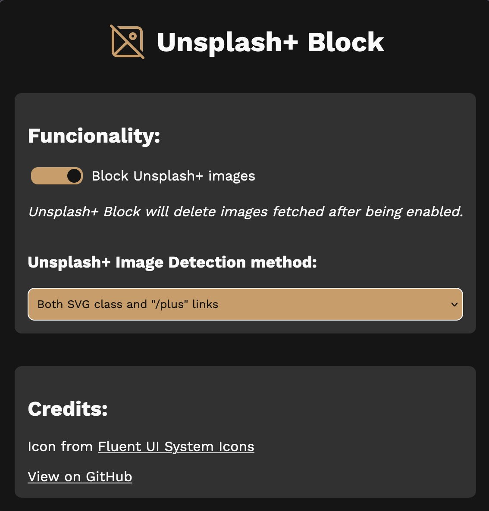
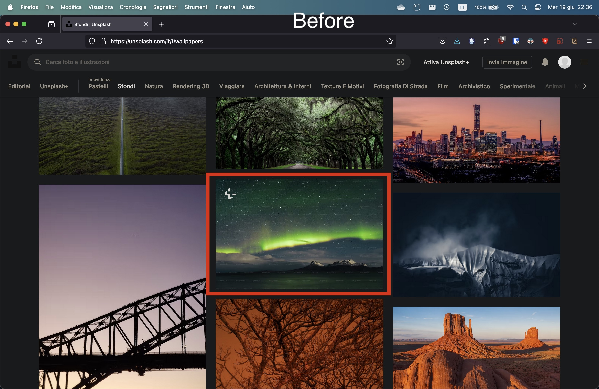
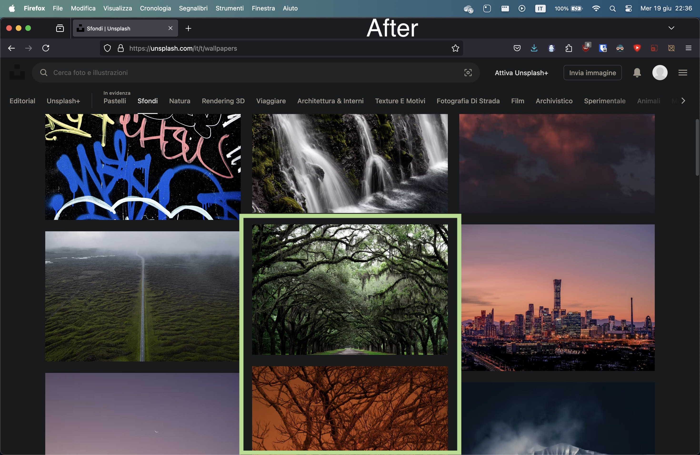

# Unsplash+ Block

A Firefox/Chromium extension that removes Unsplash+ images from Unsplash.

## Installation

First, you need to download the
[.zip file of this repository](https://github.com/Dinoosauro/unsplash-plus-block/archive/refs/heads/main.zip)

### Chromium:

Go to the `chrome://extensions` page, and enable the Developer mode slider.
Extract the .zip file, and then on your browser click on the
`Load unpacked extension` button. Choose the directory where you've extracted
the .zip file, and the extension will be installed.

### Firefox

Go to `about:debugging#/runtime/this-firefox`, and click on the
`Load Temporary Add-on` button. Choose the .zip file, and the extension will be
installed. Now click on the extension icon and grant permission to edit the
Unsplash page. Refresh the Unsplash page (if you've opened it), and you're ready
to go.

## Extension UI

 From the UI, you
can

- Grant access to edit Unsplash webpage
- Enable or disable the extension
- Change the mode Unsplash+ Block detects an Unsplash+ Image

## Before and after

